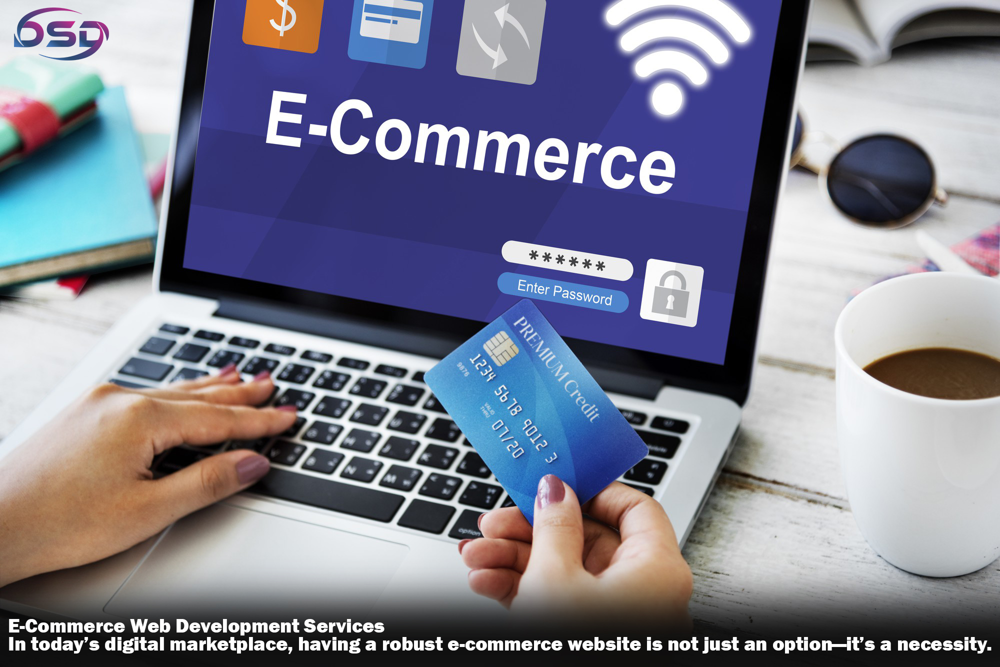

### E-Commerce Web Development Services

  

In today’s digital marketplace, having a robust e-commerce website is not just an option—it’s a necessity. E-commerce platforms have revolutionized how businesses reach customers, streamline operations, and boost revenue. At DSD Systems Pvt Ltd, we specialize in delivering top-notch [e-commerce web development services](https://dsdspl.com/web-dev) tailored to your business needs, ensuring a seamless shopping experience for your customers.

  

Why Invest in e-commerce web development services?

A well-designed e-commerce platform does more than sell products; it creates a brand experience, builds trust, and encourages repeat business. Here’s why businesses are turning to custom e-commerce solutions:

  

*   24/7 Availability: Your shop is open around the clock, catering to customers worldwide.
    
*   Personalized Shopping Experience: Tailored features, recommendations, and intuitive interfaces improve customer satisfaction.
    
*   Scalability: Easily add new products, categories, and features as your business grows.
    
*   Data-Driven Decisions: Leverage analytics to understand customer behavior and optimize sales strategies.
    

## How DSD Systems Pvt Ltd Delivers Success

At DSD Systems Pvt Ltd, we combine technical expertise with industry insights to create powerful e-commerce platforms that help you achieve your business goals.

### 1\. Custom E-Commerce Solutions

We build platforms that are unique to your brand, ensuring that every feature, design, and functionality aligns with your business strategy.

### 2\. Mobile-First Design

With the majority of customers shopping on their phones, we design mobile-responsive e-commerce websites that deliver exceptional performance on any device.

### 3\. Integration Capabilities

From payment gateways to inventory management systems, we integrate third-party tools seamlessly to enhance functionality and simplify operations.

### 4\. Secure Transactions

We prioritize security by implementing advanced encryption, SSL certificates, and compliance with data protection regulations.

Our [e-commerce web development services](https://dsdspl.com/web-dev)

1\. Custom E-Commerce Platforms

Whether you're launching a new store or upgrading an existing one, we design platforms tailored to your unique requirements.

2\. Multi-Vendor Marketplaces

Build a thriving marketplace where multiple vendors can showcase their products under one roof.

3\. Progressive Web Apps (PWAs)

Enhance the user experience with fast-loading, app-like e-commerce websites that work seamlessly across devices.

4\. Maintenance and Support

We provide ongoing help to ensure your e-commerce platform runs smoothly, with updates and improvements as needed.

  

Why Choose DSD Systems Pvt Ltd?

Choosing the right development partner is critical to the success of your online store. Here’s why businesses trust DSD Systems Pvt Ltd:

*   Expertise: Our team has extensive experience creating e-commerce websites across various industries.
    
*   Customization: We tailor every aspect of your platform to meet your goals and enhance customer satisfaction.
    
*   Innovation: Leveraging the latest technologies, we create future-ready solutions.
    
*   Customer-Centric Approach: Your success is our priority. We cooperate closely to ensure your vision comes to life.
    

Conclusion

E-commerce is the future of retail, and with DSD Systems Pvt Ltd, you can stay ahead of the competition. Our custom [e-commerce web development services](https://dsdspl.com/web-dev) empower you to create a seamless, safe, and scalable platform tailored to your unique needs.  
  

Link Here:- [https://dsdspl.com/web-dev](https://dsdspl.com/web-dev)
